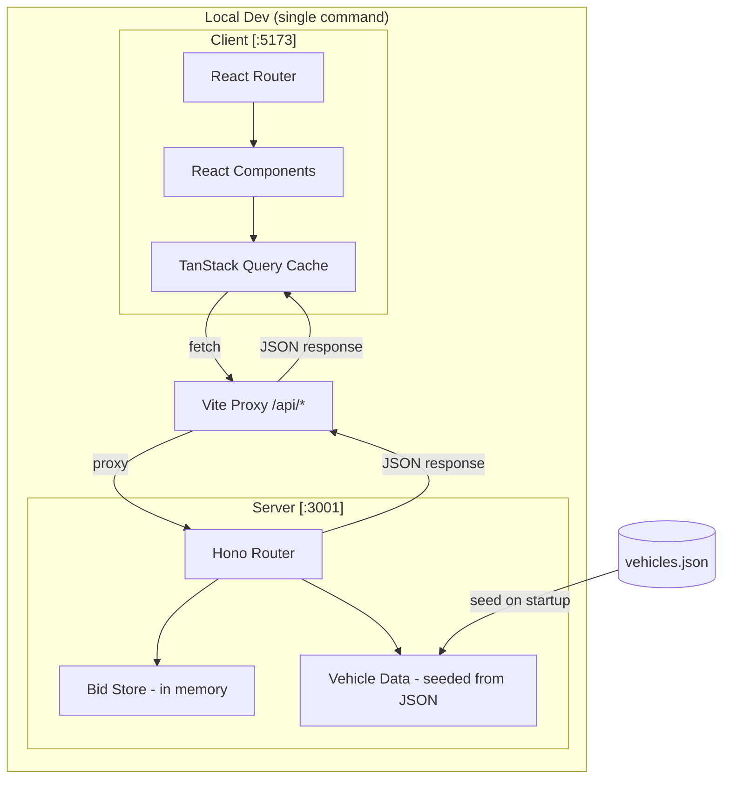
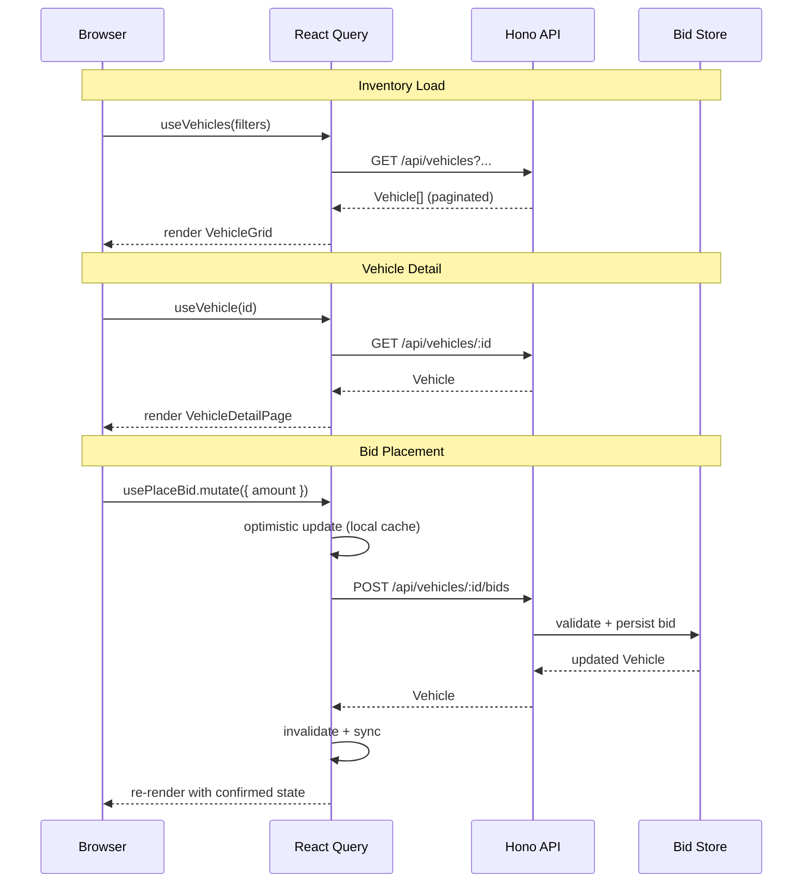

# System Architecture

## Overview

A buyer-side vehicle auction platform built as a full-stack web application. The stack is deliberately minimal: a thin Hono API server seeds from `vehicles.json` and persists bid state in memory, while a React SPA handles all presentation logic. Everything runs from one command.

---

## Stack Rationale

| Layer | Choice | Why |
|---|---|---|
| Frontend framework | React + Vite + TypeScript | OPENLANE's own suggestion; industry standard for SPAs |
| UI system | shadcn/ui + Tailwind CSS | Radix primitives for accessibility, Tailwind for speed, fully customizable |
| Server state | TanStack Query (React Query v5) | Declarative caching, mutations, optimistic updates — the right tool for auction data |
| Client state | URL search params + React state | Filters are shareable links; no global store needed |
| Routing | React Router v6 | Standard, well-understood, supports nested layouts |
| Backend | Hono (TypeScript) | Edge-native, tiny, fast to write, shows API thinking |
| Data persistence | In-memory (seeded from vehicles.json) | Appropriate for a prototype; upgrade path is clear |
| Monorepo | pnpm workspaces + concurrently | Single `npm run dev` for reviewer DX |

---

## System Architecture Diagram



---

## API Surface

```
GET  /api/vehicles
     ?q=ford&make=Ford&body_style=SUV
     &condition_min=3.0&price_min=10000&price_max=50000
     &province=Ontario&title_status=clean&fuel_type=gasoline
     &sort=current_bid_desc&page=1&limit=24

GET  /api/vehicles/:id

POST /api/vehicles/:id/bids
     Body: { amount: number }
     Validates: amount ≥ current_bid + MIN_INCREMENT ($250)
                auction status is LIVE
     Response: updated Vehicle object
```

---

## Data Flow



---

## Scalability Discussion (walkthrough talking points)

**What changes at scale:**

| Concern | Prototype approach | Production approach |
|---|---|---|
| Data store | In-memory array | PostgreSQL + Redis for hot auction state |
| Search/filter | Server-side array filter | Elasticsearch or Typesense |
| Real-time bids | Polling or optimistic UI | WebSockets with event sourcing |
| Auction state | Normalized on request | Materialized view, updated by scheduled job |
| Images | Placehold.co URLs | S3 + CloudFront CDN |
| Concurrent bids | N/A | Optimistic locking / distributed lock per vehicle |
| Pagination | Offset-based | Cursor-based (stable under sort changes) |

**Why this architecture is the right prototype shape:**
- The API boundary is real — swapping the in-memory store for PostgreSQL requires zero frontend changes
- TanStack Query's mutation+invalidation pattern maps directly to WebSocket-triggered cache busts
- The bid validation logic in the server is identical to what production would enforce

---

## Dev Setup (target reviewer experience)

```bash
git clone <repo>
cd openlane-block
npm install        # installs all workspaces
npm run dev        # starts client :5173 and server :3001 concurrently
# open http://localhost:5173
```
