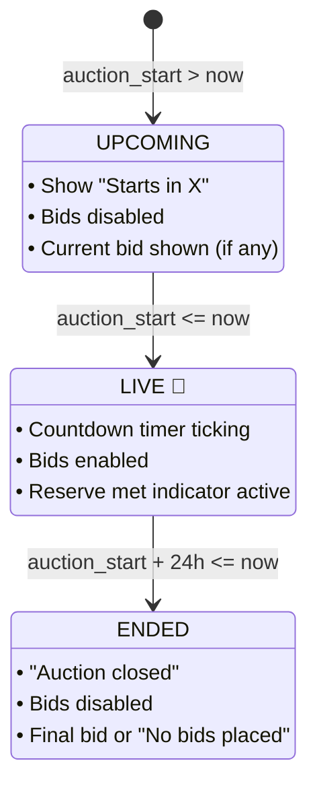
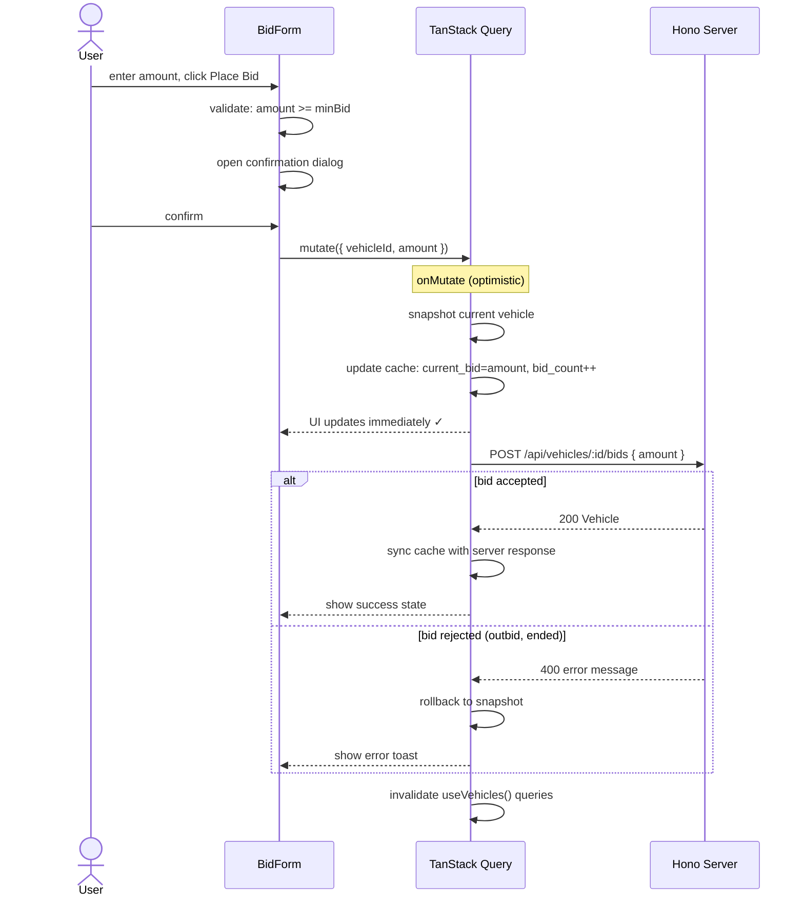

# Auction State Machine & Bid Logic

## Auction Status State Machine



---

## Auction Time Normalization (prototype strategy)

The dataset's `auction_start` values are synthetic, so we normalize them relative to `now` at server startup so the demo always has a good distribution of live/upcoming/ended vehicles.

```typescript
function normalizeAuctionTimes(vehicles: Vehicle[]): Vehicle[] {
  const now = Date.now();
  return vehicles.map((v, i) => {
    const bucket = i % 3;
    let offsetMs: number;

    if (bucket === 0) {
      // LIVE: started 2–12 hours ago
      offsetMs = -(2 + (i % 10)) * 60 * 60 * 1000;
    } else if (bucket === 1) {
      // UPCOMING: starts in 1–48 hours
      offsetMs = (1 + (i % 47)) * 60 * 60 * 1000;
    } else {
      // ENDED: started 25–72 hours ago
      offsetMs = -(25 + (i % 47)) * 60 * 60 * 1000;
    }

    return {
      ...v,
      auction_start: new Date(now + offsetMs).toISOString(),
    };
  });
}
```

**Result**: ~67 live, ~67 upcoming, ~67 ended — the buyer always has live auctions to bid on.

---

## Bid Validation Logic

```
POST /api/vehicles/:id/bids
Body: { amount: number }

VALIDATION (server-side, in order):

1. Vehicle exists?                  → 404 if not
2. Auction is LIVE?                 → 400 "Auction is not currently active"
3. amount is a number?              → 400 "Invalid bid amount"
4. No current bid?
     amount >= starting_bid        → 400 "Bid must meet starting bid"
   Has current bid?
     amount >= current_bid + 250   → 400 "Bid must exceed current bid by at least $250"
5. Buy-now price exists?
     amount >= buy_now_price        → auto-convert to buy-now (or reject, TBD)

SUCCESS:
  - Update current_bid = amount
  - Increment bid_count
  - Return updated Vehicle
```

---

## Bid Flow (sequence with optimistic update)



---

## Minimum Bid Increment Logic (UI)

```typescript
const MIN_INCREMENT = 250;

function getMinimumBid(vehicle: Vehicle): number {
  if (vehicle.current_bid === null) {
    return vehicle.starting_bid;
  }
  return vehicle.current_bid + MIN_INCREMENT;
}

// Quick bid buttons are relative to minimum bid:
// [+$250] [+$500] [+$1,000] [+$2,500]
function getQuickBids(minBid: number): number[] {
  return [minBid, minBid + 250, minBid + 750, minBid + 2250];
}
```

---

## Reserve Price Logic

The `reserve_price` is present in the data. The prototype handles it as follows:

| State | reserve_price | current_bid | Display |
|---|---|---|---|
| No reserve | null | any | "No reserve" badge |
| Reserve not met | 30000 | 22000 | "Reserve not met" (amber) |
| Reserve met | 30000 | 31000 | "Reserve met" (green) ✓ |
| Reserve info hidden | — | — | Reserve price $ is never shown to buyer |

**Tradeoff**: Showing reserve met/not met is industry standard for vehicle auctions. Revealing the exact reserve price would undermine the auction dynamic.

---

## AuctionStatus Chip Visual Design

```
UPCOMING  →  [○ Starts in 2h 14m]  (slate background)
LIVE      →  [● LIVE]               (red, pulsing dot)
ENDED     →  [✓ Closed]             (muted, grey)
```
