# Component Architecture & Wiring

## Full Component Tree

```mermaid
graph TD
    App["App (React Router)"]

    App --> RootLayout
    RootLayout --> Header
    RootLayout --> Outlet

    Header --> Logo
    Header --> GlobalSearch["GlobalSearch (navigates to /?q=...)"]

    Outlet --> InventoryPage
    Outlet --> VehicleDetailPage

    subgraph "/ — InventoryPage"
        InventoryPage --> FilterSidebar
        InventoryPage --> InventoryMain

        FilterSidebar --> FS_Make["FilterSection: Make"]
        FilterSidebar --> FS_Body["FilterSection: Body Style"]
        FilterSidebar --> FS_Cond["FilterSection: Condition Grade (range)"]
        FilterSidebar --> FS_Price["FilterSection: Price Range (dual slider)"]
        FilterSidebar --> FS_Prov["FilterSection: Province"]
        FilterSidebar --> FS_Title["FilterSection: Title Status"]
        FilterSidebar --> FS_Fuel["FilterSection: Fuel Type"]

        InventoryMain --> InventoryToolbar
        InventoryMain --> VehicleGrid
        InventoryMain --> VehicleList

        InventoryToolbar --> ResultCount
        InventoryToolbar --> ActiveFilterChips
        InventoryToolbar --> SortDropdown
        InventoryToolbar --> ViewToggle

        VehicleGrid --> VehicleCard
        VehicleList --> VehicleCard

        VehicleCard --> CardImage["LazyImage"]
        VehicleCard --> ConditionBadge
        VehicleCard --> AuctionStatusChip
        VehicleCard --> BidSummary
    end

    subgraph "/vehicles/:id — VehicleDetailPage"
        VehicleDetailPage --> BreadcrumbNav
        VehicleDetailPage --> ImageGallery
        VehicleDetailPage --> VehicleInfo
        VehicleDetailPage --> AuctionPanel

        ImageGallery --> MainImage
        ImageGallery --> ThumbnailStrip

        VehicleInfo --> VehicleHeader["VehicleHeader (Year Make Model Trim)"]
        VehicleInfo --> SpecsGrid
        VehicleInfo --> ConditionGradeBar["ConditionGradeBar (1.0–5.0 visual)"]
        VehicleInfo --> ConditionReport
        VehicleInfo --> DamageNotes["DamageNotes (badges)"]
        VehicleInfo --> DealerInfo

        AuctionPanel --> AuctionTimer
        AuctionPanel --> AuctionStatusBadge
        AuctionPanel --> BidStats["BidStats (count + reserve met)"]
        AuctionPanel --> BidForm
        AuctionPanel --> BuyNowButton

        BidForm --> QuickBidButtons["QuickBidButtons (+$250 +$500 +$1k)"]
        BidForm --> BidAmountInput
        BidForm --> MinBidHint
        BidForm --> PlaceBidButton
        BidForm --> BidConfirmDialog
    end
```



---

## State Ownership Map

| State | Owner | How stored | Why here |
|---|---|---|---|
| Filter values | URL search params | `useSearchParams()` | Shareable links, browser back works |
| Sort selection | URL search params | `useSearchParams()` | Same reason |
| View mode (grid/list) | `InventoryPage` local state | `useState` | Not shareable, ephemeral UI |
| Vehicle list | TanStack Query | Query cache | Server data, needs cache invalidation |
| Vehicle detail | TanStack Query | Query cache | Server data |
| Current bid (post-mutation) | TanStack Query | Optimistic update → server sync | Live auction data |
| Image gallery selected index | `ImageGallery` local state | `useState` | Pure UI state |
| Bid form amount | `BidForm` local state | `useState` (controlled input) | Form state |
| Bid confirmation open | `BidForm` local state | `useState` | UI state |

---

## Component Contracts (key interfaces)

```typescript
// VehicleCard — drives both grid and list layouts
interface VehicleCardProps {
  vehicle: Vehicle;
  layout: 'grid' | 'list';
}

// AuctionPanel — the sticky bidding UI
interface AuctionPanelProps {
  vehicle: Vehicle;
  auctionStatus: 'upcoming' | 'live' | 'ended';
}

// BidForm — emits only when valid
interface BidFormProps {
  vehicleId: string;
  currentBid: number | null;
  startingBid: number;
  onBidPlaced: (amount: number) => void;
}

// ConditionGradeBar — visual trust signal
interface ConditionGradeBarProps {
  grade: number;       // 1.0 – 5.0
  showLabel?: boolean;
}

// AuctionTimer — countdown or status text
interface AuctionTimerProps {
  auctionStart: string;  // ISO datetime
  status: 'upcoming' | 'live' | 'ended';
}
```

---

## Data Hooks (TanStack Query)

```
hooks/
├── useVehicles(filters: FilterState) → { data, isLoading, error }
│   └── GET /api/vehicles?<serialized filters>
│       Enabled: always
│       StaleTime: 30s (bids change, but not specs)
│
├── useVehicle(id: string) → { data, isLoading, error }
│   └── GET /api/vehicles/:id
│       Enabled: !!id
│       StaleTime: 10s (live auction needs fresher data)
│
└── usePlaceBid(id: string)
    └── POST /api/vehicles/:id/bids
        onMutate: optimistic update (increment bid, count)
        onError: rollback to previous state
        onSettled: invalidate useVehicle(id) + useVehicles()
```

---

## File Structure

```
client/
├── src/
│   ├── components/
│   │   ├── layout/
│   │   │   ├── Header.tsx
│   │   │   └── RootLayout.tsx
│   │   ├── inventory/
│   │   │   ├── VehicleCard.tsx
│   │   │   ├── VehicleGrid.tsx
│   │   │   ├── VehicleList.tsx
│   │   │   ├── FilterSidebar.tsx
│   │   │   ├── FilterSection.tsx
│   │   │   ├── InventoryToolbar.tsx
│   │   │   └── ActiveFilterChips.tsx
│   │   ├── vehicle/
│   │   │   ├── ImageGallery.tsx
│   │   │   ├── ConditionGradeBar.tsx
│   │   │   ├── DamageNotes.tsx
│   │   │   └── SpecsGrid.tsx
│   │   ├── auction/
│   │   │   ├── AuctionPanel.tsx
│   │   │   ├── AuctionTimer.tsx
│   │   │   ├── AuctionStatusChip.tsx
│   │   │   ├── BidForm.tsx
│   │   │   └── BidStats.tsx
│   │   └── ui/                 ← shadcn/ui components (generated)
│   ├── hooks/
│   │   ├── useVehicles.ts
│   │   ├── useVehicle.ts
│   │   └── usePlaceBid.ts
│   ├── lib/
│   │   ├── api.ts              ← typed fetch wrappers
│   │   ├── auction.ts          ← getAuctionStatus(), normalizeAuctionTime()
│   │   └── formatters.ts       ← formatCurrency(), formatOdometer()
│   ├── types/
│   │   └── vehicle.ts          ← Vehicle, FilterState, SortKey types
│   └── pages/
│       ├── InventoryPage.tsx
│       └── VehicleDetailPage.tsx

server/
├── src/
│   ├── index.ts                ← Hono app entry
│   ├── routes/
│   │   ├── vehicles.ts         ← GET /vehicles, GET /vehicles/:id
│   │   └── bids.ts             ← POST /vehicles/:id/bids
│   ├── store/
│   │   └── vehicleStore.ts     ← in-memory store + seed logic
│   └── lib/
│       └── auctionUtils.ts     ← bid validation, status computation
```
